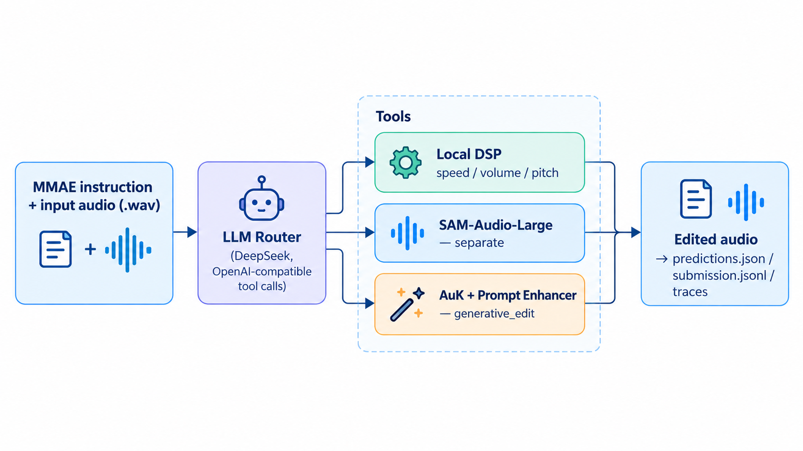

# ICASSP 2027 Audio Editing Challenge Baselines

Reproducible baselines for the [ICASSP 2027 Audio Editing Challenge](https://audio-editing-challenge.github.io/) on the [MMAE benchmark](https://github.com/ddlBoJack/MMAE).

| Track | Baseline | Entry point |
| --- | --- | --- |
| Single Model | AuK base model with Prompt Enhancer disabled | `run_single_mmae.py` |
| Agent | LLM router with DSP, SAM-Audio and AuK tools | `run_agent_mmae.py` |

Both tracks use the same setup, launch and output format.

## Data

Download the MMAE metadata and audio:

```bash
git clone https://github.com/ddlBoJack/MMAE.git
hf download BoJack/MMAE \
  --repo-type dataset \
  --include "wav/**" \
  --local-dir ./MMAE
```

The expected inputs are:

```text
MMAE/MMAE-meta.json
MMAE/wav/
```

## Single Model Track

This baseline uses the [AuK](https://github.com/Tencent-Hunyuan/AuK) base checkpoint as a single end-to-end model. Prompt Enhancer is disabled, and the output duration matches the input duration.

Set the AuK repository path if it is not in the default location:

```bash
export AUK_REPO=/path/to/AuK
```

Download the required weights into the AuK repository:

```bash
hf download tencent/AuK --local-dir "$AUK_REPO/ckpts/AuK"
hf download Qwen/Qwen2.5-Omni-3B \
  --local-dir "$AUK_REPO/ckpts/Qwen2.5-Omni-3B"
```

Set up and run:

```bash
./setup.sh single
./run.sh single \
  --meta ./MMAE/MMAE-meta.json \
  --output-dir ./outputs/single
```

The default scope is the MMAE `single` subset with 1003 samples.

## Agent Track

The agent uses an OpenAI-compatible LLM (DeepSeek API by default) to route each instruction to one of five tools:

| Tool | Implementation |
| --- | --- |
| Speed, Volume, Pitch | Local DSP |
| Separation | SAM-Audio-Large |
| Generative editing | AuK with Prompt Enhancer |



SAM-Audio (separation) and AuK (generative editing) are large models with conflicting dependencies, so each runs in its own environment and the router calls them over HTTP — `run.sh` starts and stops both services for you. Install the two models once (following each project's README), then point this repo at them:

```bash
# SAM-Audio — github.com/facebookresearch/sam-audio (its own env + gated HF weights):
export SAM_AUDIO_PYTHON=/path/to/sam-audio-env/bin/python   # env with the `sam_audio` package
export SAM_AUDIO_HOME=/path/to/sam-audio-weights            # optional: HF cache for facebook/sam-audio-*
# AuK — its checkout + weights:
export AUK_REPO=/path/to/AuK
# router LLM:
export DEEPSEEK_API_KEY=...
```

Set up and run:

```bash
./setup.sh agent
./run.sh agent \
  --meta ./MMAE/MMAE-meta.json \
  --output-dir ./outputs/agent
```

`run.sh` starts the SAM-Audio and AuK services on idle GPUs, waits for them to become ready, and stops them when inference finishes. The default scope is the full MMAE benchmark with 2000 samples.

## Results

Results were evaluated locally with Qwen3-Omni-30B-A3B-Instruct.

| Baseline | Scope | IFR | CR | EMR |
| --- | --- | :---: | :---: | :---: |
| Single Model | Single subset, 1003 samples | 42.12% | 75.78% | 7.58% |
| Agent | Full benchmark, 2000 samples | 44.06% | 74.63% | 7.45% |

The rows use different evaluation scopes and should not be compared directly.

## Outputs

Each run writes the following files under `--output-dir`:

```text
audio/<id>.wav      Edited audio
predictions.json    Input for the MMAE evaluator
submission.jsonl    Leaderboard manifest
run_meta.json       Run configuration and statistics
traces/<id>.json    Agent routing trace, Agent Track only
```

Use `predictions.json` with the official MMAE evaluator. See the [MMAE evaluation instructions](https://github.com/ddlBoJack/MMAE#evaluation) for judge setup and scoring.
